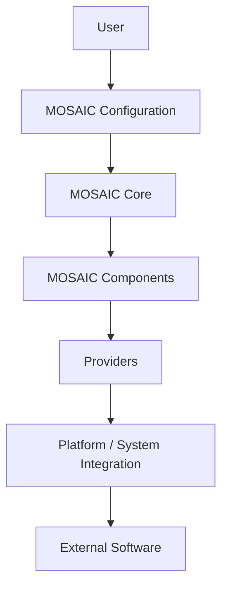

+++
title = "MOSAIC Architecture"
weight = 1
+++

# MOSAIC Architecture

**Status:** Proposed

**Issue:** #1 — Define MOSAIC architecture

## 1. Purpose

MOSAIC is a modular Linux desktop configuration framework designed to provide a consistent abstraction layer between a user's desired desktop configuration and the underlying software used to implement it.

MOSAIC should allow users to assemble desktop environments from independent components while keeping those components replaceable, configurable, and reproducible.

The architecture exists to ensure that MOSAIC does not become tightly coupled to a particular compositor, desktop environment, distribution, application, or implementation.

MOSAIC should provide structure and tooling without taking ownership away from the user.

---
## 2. Architectural Goals

The MOSAIC architecture is built around the following principles.

### 2.1 Modular

MOSAIC functionality should be divided into independent components with clearly defined responsibilities.

A component should be replaceable without requiring unrelated parts of MOSAIC to be redesigned.

### 2.2 Configurable

Users should be able to configure individual aspects of their desktop without modifying the MOSAIC core.

Configuration should be represented separately from implementation-specific configuration files wherever practical.

### 2.3 Reproducible

A MOSAIC configuration should be portable and reproducible.

Given the same configuration, compatible components, and supported environment, MOSAIC should be capable of reconstructing the intended desktop configuration.

### 2.4 Maintainable

MOSAIC should prefer simple, explicit boundaries over tightly coupled systems.

Architecture should remain understandable to contributors as the project grows.

### 2.5 Provider-independent

MOSAIC concepts should not be defined by a specific implementation.

For example:

> A MOSAIC status bar is not a Waybar configuration.

Instead:

> Waybar is one provider capable of implementing a MOSAIC status bar.

This distinction allows future providers to implement the same MOSAIC concept.

### 2.6 User-owned

MOSAIC should not prevent users from accessing or modifying the underlying configuration.

MOSAIC provides an abstraction and management layer; it does not replace Linux configuration with an opaque system.

### 2.7 Linux-first

MOSAIC is designed for the Linux desktop ecosystem.

However, Linux distribution-specific or implementation-specific behavior should not leak unnecessarily into the MOSAIC core.

### 2.8 Explicit dependencies

Dependencies between MOSAIC subsystems should be deliberate and documented.

A subsystem should not implicitly depend on another subsystem simply because the dependency is convenient.

---

## 3. Architectural Model

MOSAIC is organized into several conceptual layers



The important architectural direction is:

**User → MOSAIC → implementation**

rather than:

**implementation → MOSAIC**

MOSAIC defines the desired configuration and behavior at an abstract level.

Providers and integrations translate that model into the concrete technologies available on a user's system.

---

## 4. Major Subsystems

MOSAIC is composed of several major conceptual subsystems.

These boundaries describe responsibilities rather than necessarily representing separate processes or packages.

### 4.1 MOSAIC Core

The core contains the fundamental models, rules, interfaces, and orchestration logic required by MOSAIC.

Responsibilities include:
- Representing MOSAIC configuration
- Representing components
- Representing profiles
- Representing themes
- Representing layouts
- Validating configuration
- Resolving dependencies
- Managing component relationships
- Providing common interfaces
- Coordinating configuration application

The core should contain **no implementation-specific logic where an abstraction can be used instead**.

For example, the core should not contain logic that assumes Hyprland exists.

---

## 5. Components

A component represents an independently manageable part of a desktop configuration.

Examples include:
- Window managers
- Compositors
- Status bars
- Application launchers
- Notification systems
- Lock screens
- Idle daemons
- Wallpapers
- Terminals
- Shell environments
- Keybinding systems
- Authentication utilities
- System utilities
- Desktop scripts

Components should expose a defined interface to MOSAIC.

A component may have implementation-specific requirements, but those requirements should remain inside the component or its provider integration.

Components should avoid directly modifying unrelated components.

---

## 6. Providers

A provider is an implementation of a MOSAIC concept using a specific external technology.

For example:
```
MOSAIC Status Bar
       │
       ├── Waybar Provider
       ├── Quickshell Provider
       └── Future Provider
```

Likewise:
```
MOSAIC Compositor
       │
       ├── Hyprland Provider
       ├── Future Compositor Provider
       └── ...
```

Providers are responsible for translating MOSAIC's abstract configuration into implementation-specific configuration.

This creates an important boundary:
> **MOSAIC describes what the user wants. Providers determine how the underlying software implements it.**

---

## 7. Platform Integration

MOSAIC requires interaction with the operating system.

Platform integration is responsible for operations such as:
- Filesystem locations
- Environment variables
- Process management
- Package installation
- Service management
- Permissions
- User directories
- System capabilities
- Hardware or display information

These operations should be isolated behind platform interfaces wherever practical.

This prevents the MOSAIC core from directly depending on a particular Linux distribution or system implementation.

---

## 8. Distribution Independence

MOSAIC should not assume that a particular Linux distribution is the only supported environment.

For example, the architecture should avoid embedding assumptions such as ```/etc/pacman.conf``` inside the core.

Instead, package management or distribution-specific operations should occur through a platform/provider boundary.

This allows MOSAIC to initially target one distribution while preserving the possibility of supporting others later.

### Initial Implementation

The initial MOSAIC implementation may target Arch Linux and Hyprland.

This is an implementation constraint, not an architectural requirement.

---

## 9. Profiles

A profile represents a complete or partial desktop configuration assembled from MOSAIC components.

For example:
```
Profile
├── Compositor
├── Status Bar
├── Launcher
├── Notifications
├── Lock Screen
├── Wallpaper
├── Theme
└── Keybindings
```

Profiles should reference components and configuration rather than containing implementation-specific logic themselves.

Profiles should therefore remain portable between compatible environments.

---

## 10. Themes

A theme represents visual and stylistic configuration.

Themes may control things such as:
- Colors
- Fonts
- Icons
- Wallpapers
- Borders
- Transparency
- Component styling

Themes should remain conceptually separate from the components they modify.

For example:

```
Profile
    +
Theme
    +
Layout
    =
Desktop Configuration
```

This allows users to change visual appearance without replacing the underlying profile.

---

## 11. Layouts

A layout describes the arrangement and presentation of desktop interface elements.

A layout should describe **what the interface looks like conceptually**, rather than being defined by a particular implementation.

For example, a layout might define:
```
Top Bar
├── Workspace Indicator
├── Window Information
├── System Status
└── Clock
```

A provider may then translate what the abstract layout into Waybar, Quickshell, or another implementation.

---

## 12. Configuration

Configuration is a cross-cutting architectural concern.

MOSAIC configuration should describe the user's intended desktop state rather than merely storing generated configuration files.

The architecture should distinguish between:
```
User configuration
        ↓
MOSAIC configuration model
        ↓
Generated/provider configuration
        ↓
External application
```

Generated configuration should not automatically become the user's source of truth.

The detailed configuration architecture will be defined separately in [Configuration Architecture](configuration-architecture.md).

---

## 13. Dependency Rules

MOSAIC should follow a controlled dependency direction.

### Allowed
```
MOSAIC Core
    ↓
Interfaces
    ↓
Providers
    ↓
External Software
```

### Discouraged
```
MOSAIC Core
    ↓
Hyprland-specific implementation
```

### Prohibited architectural coupling

A component should not directly depend on another unrelated component's implementation.

For example:
```
Waybar component
    ↓
Hyprland configuration files
```

Should not be required merely because both components happen to be used together.

Where communication is necessary, it should occur through a defined interface or integration mechanism.

---

## 14. Configuration Generation

MOSAIC may generate configuration files required by external applications.

Generated configuration is considered an implementation detail.

The architecture should preserve a distinction between:
- User-owned configuration
- MOSAIC-managed configuration
- Provider-generated configuration
- External application state

This distinction is essential for reproducibility and user control.

---

## 15. Extension Model

MOSAIC should allow additional functionality to be introduced without modifying the core.

Potential extension mechanisms include:
- Providers
- Components
- Themes
- Layouts
- Plugins
- Integrations

The exact plugin architecture will be defined separately.

Extensions should interact with MOSAIC through documented interfaces rather than relying on internal implementation details.

---

## 16. User Interface and CLI

MOSAIC may eventually provide multiple interfaces for managing the same underlying configuration.

Potential interfaces include:
```
                MOSAIC Core
               /           \
          CLI                 GUI
```

The CLI and GUI should not independently implement MOSAIC's configuration logic.

Instead, both should operate through the same underlying models and services.

This prevents the GUI and CLI from developing separate interpretations of MOSAIC configuration.

---

## 17. Direct User Modification

MOSAIC must preserve the ability for advanced users to directly modify their configuration.

MOSAIC should therefore avoid creating an architecture where:

> " MOSAIC manages everything and the user must never touch it."

Instead:

> "MOSAIC manages configuration where the user chooses to let it."

The architecture should clearly identify which files are generated, managed, or user-owned.

---

## 18. OS and Implementation Boundaries

MOSAIC should maintain explicit boundaries between:

```
MOSAIC concepts
        │
        ▼
MOSAIC abstractions
        │
        ▼
Provider implementations
        │
        ▼
Operating system
        │
        ▼
External software
```

The further upward a dependency reaches the more abstract it should become.

Implementation-specific details should remain as close as possible to the implementation that requires them.

---

## 19. Reproducibility

A MOSAIC configuration should contain enough information to describe the intended desktop state.

Reproducibility should eventually allow a user to:

```
Export configuration
        ↓
Transfer configuration
        ↓
Install required components
        ↓
Apply configuration
        ↓
Recreate desktop
```

Reproducibility does not necessarily mean reproducing every byte of every generated configuration file.

It means reproducing the **declared MOSAIC configuration and resulting desktop behavior** within the limits of the target environment.

---

## 20. Maintainability

MOSAIC should favor:
- Small, well-defined components
- Explicit interfaces
- Minimal coupling
- Declarative configuration
- Predictable directory structures
- Documented dependencies
- Stable public interfaces
- Replaceable implementations
- Automated validation where practical

MOSAIC should avoid unnecessary abstraction.

An abstraction should exist because it protects a meaningful architectural boundary, not simply because abstraction is considered desirable.

---

## 21. Architectural Boundaries

The following boundaries are fundamental to MOSAIC.

### Core ↔ Provider

The core defines concepts and interfaces.

The provider implements them.

### Provider ↔ External Software

The provider translates MOSAIC configuration into the configuration and operations required by external software.

### Configuration ↔ Generated Configuration

The user's MOSAIC configuration is the source of intent.

Generated configuration is an implementation artifact.

### Component ↔ Component

Components should remain independent unless an explicit dependency or integration is defined.

### MOSAIC ↔ Operating System

OS-specific behavior belongs behind platform integration boundaries.

---

## 22. What MOSAIC Is Not

MOSAIC is not intended to be:
- A replacement Linux distribution
- A replacement window manager
- A monolithic desktop environment
- A collection of inseparable dotfiles
- A compositor-specific configuration framework
- A package manager
- A system init system
- A mandatory GUI
- An abstraction that prevents users from accessing their own configuration

MOSAIC is a **configuration and composition layer** for assembling Linux desktop environments from modular components.

---

## 23. Initial Implementation

The first implementation will target:
- Linux
- Arch Linux
- Hyprland
- Waybar
- Other supporting desktop utilities as required

These technologies are used to validate the architecture against a real desktop environment.

They should not define the architecture itself.

The architecture should remain capable of supporting alternative providers and environments in the future.

---

## 24. Architectural Decision Records

Significant architectural decisions should be recorded separately from the main architecture document.

An Architecture Decision Record should describe:

1. The decision
2. The context
3. The alternatives considered
4. The reasoning
5. The consequences

This allows the project to preserve not only **what MOSAIC does**, but **why it was designed that way**.

---

## 25. Evolution

This document defines the current architectural direction of MOSAIC.

The architecture is expected to evolve as implementation reveals requirements that were not known during initial design.

Changes to fundamental architectural principles should be documented and justified through an Architecture Decision Record where appropriate.

Architecture should evolve deliberately rather than through accidental coupling introduced by individual features.

---

## 26. Summary

MOSAIC is structured around a simple principle:

> **MOSAIC defines the desktop configuration; implementations provide the means to realize it.**

the architecture therefore separates:
```
User Intent
    ↓
MOSAIC Configuration
    ↓
MOSAIC Core
    ↓
Components
    ↓
Providers
    ↓
Platform Integration
    ↓
External Software
```

This separation allows MOSAIC to remain modular, configurable, reproducible, maintainable, extensible, and independent from any particular desktop implementation.
